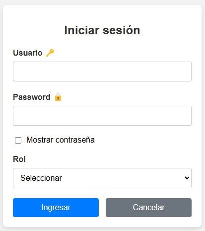

# Gestión de Cuentas y Roles

La práctica implementada consiste en un sistema de gestión de usuarios desarrollado utilizando HTML, CSS, PHP y MySQL. Este sistema permite a los usuarios iniciar sesión en función de sus roles (Usuario o Administrador) y proporciona a los administradores una interfaz para ver y administrar los usuarios registrados en la base de datos.

<p align="center">
  
</p>

Los usuarios pueden iniciar sesión proporcionando su nombre de usuario, contraseña y seleccionando su rol (Usuario o Administrador).

Se muestra un formulario de inicio de sesión con campos para el nombre de usuario, la contraseña y un menú desplegable para seleccionar el rol.

Los datos ingresados por el usuario se verifican en la base de datos para validar la autenticación.

Dependiendo del rol seleccionado, se redirige al usuario a la página correspondiente (página de usuario o página de administrador).

El sistema de gestión de usuarios proporciona una solución integral para la autenticación y administración de usuarios en una aplicación web. Utilizando tecnologías web estándar como HTML, CSS, PHP y MySQL, se garantiza una implementación robusta y escalable. Esta práctica puede servir como base para desarrollar sistemas más complejos de gestión de usuarios con funcionalidades adicionales como registro de usuarios, recuperación de contraseñas y asignación de permisos.

**Consulta la versión preliminar de la practica aquí:** [https://practica_07.com](https://alejandrovillegas.net/projects/practice-07/index.html)

# 📌 Información de la Practica

Esta practica ha sido desarrollado como parte del portafolio de soluciones tecnológicas, con el objetivo de ofrecer una herramienta eficiente y funcional para usuarios autodidactas interesados en la gestión y desarrollo de proyectos web.

- **Área**: Desarrollo de Practicas Web

- **Usuario Final**: TecNM

- **Fecha de Desarrollo**: 20 de julio de 2018

- **Portafolio de Proyectos**: [www.alejandrovillegas.net](https://www.alejandrovillegas.net/)

# Guía de Instalación y Configuración

## 🖥️ Requisitos del Sistema

Para ejecutar esta practica de manera local, es necesario contar con un entorno de desarrollo que incluya Apache, MySQL y PHP. Se recomienda el uso de **XAMPP**, ya que fue el entorno con el que se desarrolló la practica. Sin embargo, también es compatible con:

- **XAMPP** (Windows, macOS, Linux)

- **WAMP** (Windows)

- **MAMP** (macOS, Windows)

- **LAMP** (Linux)

## 🔧 Instalación y Configuración de la Practica

Siga los pasos según el entorno de desarrollo que esté utilizando:

### Para XAMPP (Recomendado)

1. Descargue y descomprima el archivo de la practica en su sistema local.

2. Copie la carpeta de la practica y colóquela en el directorio **_htdocs_** dentro de la carpeta de instalación de XAMPP (Ejemplo: **C:\xampp\htdocs\mi_practica**).

### Para WAMP

1. Descargue y descomprima el archivo de la practica.

2. Copie la carpeta de la practica y colóquela en el directorio **_www_** dentro de la carpeta de instalación de WAMP (Ejemplo: **C:\wamp64\www\mi_practica**).

### Para MAMP

1. Descargue y descomprima el archivo de la practica.

2. Copie la carpeta de la practica y colóquela en el directorio **_htdocs_** dentro de la carpeta de instalación de MAMP (Ejemplo: **/Applications/MAMP/htdocs/mi_practica**).

### Para LAMP

1. Descargue y descomprima el archivo de la practica.

2. Mueva la carpeta de la practica a **_/var/www/html/_** utilizando el siguiente comando en la terminal:

```
sudo mv mi_practica /var/www/html/
```

## 🗄️ Configuración de la Base de Datos

### Para XAMPP, WAMP y MAMP

1. Inicie su entorno de desarrollo y asegúrese de que **Apache** y **MySQL** estén en ejecución.

2. Abra su navegador y acceda a **_phpMyAdmin_** ingresando:

- **XAMPP**: http://localhost/phpmyadmin

- **WAMP**: http://localhost/phpmyadmin

- **MAMP**: http://localhost:8888/phpmyadmin

3. Diríjase a la pestaña **SQL** e ingrese el siguiente código para crear la base de datos:

```
CREATE DATABASE General;
```

4. Vaya a la pestaña Importar y seleccione el archivo **_DataBase.sql_** del repositorio para importar la estructura y los datos.

### Para LAMP

1. Abra la terminal y acceda a MySQL con:

```
mysql -u root -p
```

2. Cree la base de datos ejecutando:

```
CREATE DATABASE General;
```

3. Salga de MySQL y luego importe la base de datos con:

```
mysql -u root -p General < /ruta/del/archivo/DataBase.sql
```

Reemplace **_/ruta/del/archivo/_** con la ubicación real del archivo en su sistema.

## 🚀 Ejecución de la Practica

1. Inicie su entorno de desarrollo:

- **XAMPP**: Abra el "Panel de Control de XAMPP" y active **Apache** y **MySQL**.

- **WAMP**: Haga clic en el icono de WAMP y active los servicios.

- **MAMP**: Abra MAMP y haga clic en **Start Servers**.

- **LAMP**: Ejecute los siguientes comandos en la terminal:

```
sudo systemctl start apache2
sudo systemctl start mysql
```

2. Abra un navegador e ingrese la siguiente URL según el entorno:

- **XAMPP / WAMP**: **_http://localhost/_**

- **MAMP**: **_http://localhost:8888/_**

- **LAMP**: **_http://localhost/_**

La practica ahora está funcionando en su entorno local. 🎉

## 🔑 Credenciales de Acceso

### 🛠️ Detalles de Inicio de Sesión para Administrador

- Nombre de usuario: **_Administrador-Inventado01_**

- Contraseña: **_4321_**

### 👤 Detalles de Inicio de Sesión para Usuario Preregistrado

- Nombre de usuario: **_Usuario-Inventado01_**

- Contraseña: **_1234_**

Tambien puede **registrar un nuevo usuario** desde la interfaz de la aplicación.
